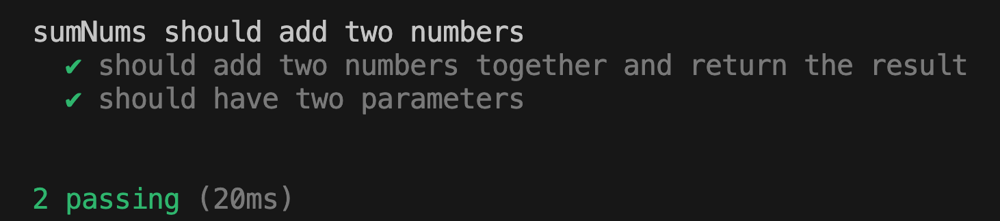

# Practice challenge

The purpose of this challenge is to walk you through how to tackle the next 46 challenges. The challenges will help you learn how to implement common computer science data structures in javascript.

Each challenge is housed in its own directory, just like this one is. Each directory incldues a markdown file with instructions for the challenge. It also includes a javascript file. After reading the instructions in the markdown file, you'll complete the challenge in the javascript file.

Once you've completed challenge, run the tests to see how you've done. If all the tests pass, you've successfully completed the challenge and can move on to the next challenge.

## Reading the markdown file

The best way to read the markdown file is to view it in the preview panel. You can access this by clicking on the preview button at the top right of the VS Code viewer.

This will allow you to see photos embedded in the text and make code snippets easily viewable.

## Completing the challenges

After you read the information and instructions in the markdown file, open your javascript file, where you will see some starter code and/or notes in the code that instruct you where to start.

Follow the instructions to complete the coding challenge. When you're done and you're ready to see how you did you can run the tests. You'll do this in your command line.

## Running the tests

Open your VS Code terminal and navigate to the directory that houses the challenge. For example, in this challeng you'll want to make sure that you're in the 00-practice-challenge directory. From there, you can run the tests by typing "npm run test". You'll see the test results in your terminal. For example, in this challenge, you'll see this in your console:

## Practice challenge instructions

In your javascript file, complete the function so that it returns the sum of two passed numbers. After you write the code to complete the challenge and run your tests, you should see this in your terminal:

If you see that in your console, congratulations, you're ready to get started learning about advanced javascript data structures.
