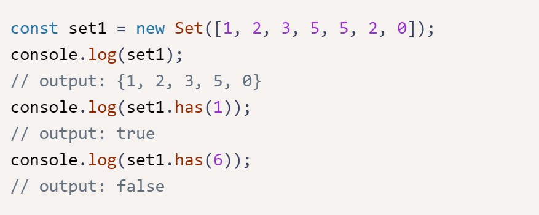

# Set Class
In this exercise we are going to create a class named Set to emulate an abstract data structure called "set". A set is like an array, but it cannot contain duplicate values. The typical use for a set is to simply check for the presence of an item. We can see how the ES6 Set object works in the example below:

First, we will create an add method that adds a value to our set collection as long as the value does not already exist in the set. Then we will create a remove method that removes a value from the set collection if it already exists. And finally, we will create a size method that returns the number of elements inside the set collection.

## Coding challenge
Create an add method that adds a unique value to the set collection and returns true if the value was successfully added and false otherwise.

Create a remove method that accepts a value and checks if it exists in the set. If it does, then this method should remove it from the set collection, and return true. Otherwise, it should return false. Create a size method that returns the size of the set collection.